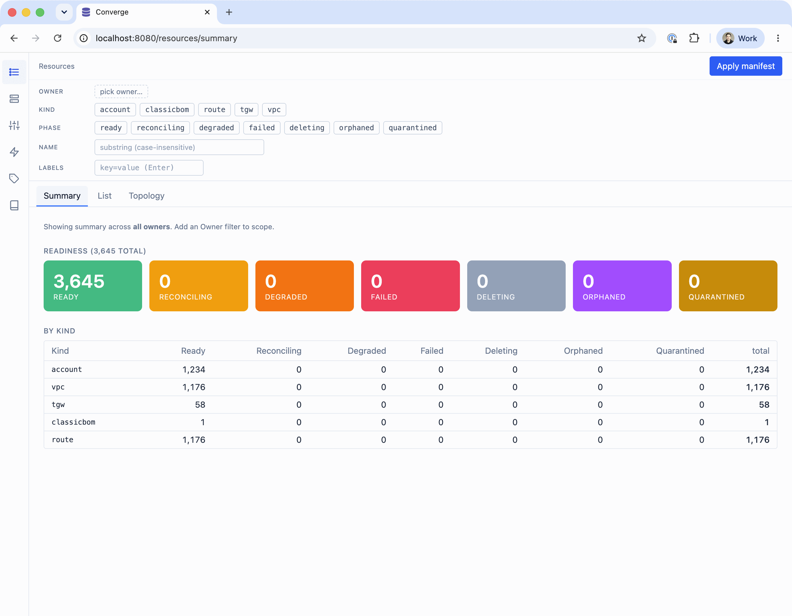

<div align="center">

# Converge — declarative resource orchestration

<p></p>

**[Introduction](#introduction) &nbsp;&nbsp;&bull;&nbsp;&nbsp;**
**[Quickstart](#quickstart) &nbsp;&nbsp;&bull;&nbsp;&nbsp;**
**[Demos](#demos) &nbsp;&nbsp;&bull;&nbsp;&nbsp;**
**[Docs](https://salesforce.github.io/converge/) &nbsp;&nbsp;&bull;&nbsp;&nbsp;**
**[API reference](https://salesforce.github.io/converge/api/) &nbsp;&nbsp;&bull;&nbsp;&nbsp;**
**[Contributing](#contributing--license)**

[](https://github.com/salesforce/converge/actions/workflows/ci.yml)

</div>

## Introduction

A declarative orchestration engine for platform teams building internal developer platforms
(IDPs), self-service infrastructure APIs, and control planes: you describe the resources you
want as specs, and Converge reconciles the world to match — composing, ordering, healing, and
rolling up status. It is built for **scale** (millions of resources, thousands of
reconciliations per second), **simplicity** (a single binary + a database), and
**reactivity** (work is pushed, not polled).

It is provider-agnostic — the core knows no concrete resource type. You teach it a *kind* by
applying a Kubernetes CRD-style manifest plus handler code in a worker, and that handler can
do anything: run Terraform, a shell script or any binary, a Kubernetes Job, or any cloud/API
call.

Like [Crossplane](https://www.crossplane.io/) and [kro](https://kro.run), it composes a
resource into a graph of children and rolls their readiness up into the composite's status —
but dependency edges and value flows are **first-class declarative data**, not imperative
controller code, so you write the composition in Go, TypeScript,
[CEL](https://github.com/google/cel-go), [Starlark](https://github.com/google/starlark-go),
or any external program. The logic that makes decisions is **real code, not a templating
dialect** — see [why workers are code, not YAML](docs/why-code-not-yaml.md) (and how an AI
agent can write one for you from the demos). See [how Converge compares](docs/how-converge-compares.md) to
Terraform/Pulumi, K8s operators, and Temporal/Restate.

Architecturally it is a single binary over Postgres — a control plane and a broker mesh that
any-language workers dial to pull work ([topology](docs/assets/topology.svg)). New here? Start
with [Concepts](docs/concepts.md) for the whole mental model on one page; for the
whole feature surface at a glance, see [Converge at a glance](docs/features.md).



## Quickstart

One command stands up the whole thing — control plane + broker mesh + a worker + the web UI, against a throwaway Postgres — and runs a live demo. You only need [`just`](https://github.com/casey/just); `just setup` checks the rest of the toolchain (Go, Node, Docker):

```bash
git clone https://github.com/salesforce/converge.git && cd converge
just setup                                  # (optional) verify Go/just/Node/Docker are installed
just install                                # install the converge/stdworker/conctl binaries onto your PATH (GOPATH/bin)
cd examples/demos/classic && just demo      # builds everything, then spins the cluster + applies a demo
```

Then open the UI at http://localhost:8080 and watch a BOM fan out into accounts/VPCs/routes/TGW and converge to Ready. `Ctrl+C` tears it all down. Eight demos cover Go, CEL, Starlark, Terraform, any-language `stdio`, TypeScript, GitOps sync, and a Backstage golden path — see [Demos](#demos) below.

## What it's great for

**Example — a landing zone.** One `landingzone` composer declares the shape once; a single
spec — `{ kind: landingzone, name: payments, spec: { accounts: 100, tier: pci } }` — fans out
into 100 AWS accounts, each expanded in dependency order into the VPCs, routes, TGW,
guardrails, and IAM that different teams own. Converge flows each account's `account_id` into
its VPC, the `vpc_id` into its routes, and rolls it all up into one status — Ready only when
every child is healthy, else Degraded naming the culprit. Edit a kind and every landing zone
re-converges; no tickets, no central Terraform monolith.

More broadly, Converge fits when many dependent resources must be *continuously* reconciled,
not provisioned once and forgotten:

- **Self-service platform APIs** — one high-level request expands into all the underlying
  cloud and API objects, so app teams declare what they want without learning the substrate.
- **Ordered dependency graphs** — resources come up in the right order, each one's outputs
  feeding the ones that depend on it, with no glue code to wire them.
- **Fleet-wide drift correction** — anything that drifts is detected and healed automatically,
  continuously, across millions of resources.
- **Status you can trust** — a composite is healthy only when everything under it is, and it
  tells you which piece is at fault when it isn't.
- **Automatic follow-up actions** — run a durable side effect whenever something changes
  (record a result, clean up, notify), without wiring a separate workflow.

## Providers

A worker is just a client that dials the broker and pulls work, so it can be written in any
language. Converge ships two worker SDKs: [`sdk-go/converge`](sdk-go/converge) for Go and
[`converge-worker-sdk`](sdk-ts) for TypeScript.

You don't have to write a provider at all. Converge ships a default worker,
[`stdworker`](cmd/stdworker/README.md), hosting a set of generic built-in providers —
including `stdio`, which makes *any external program* (a bash script, a Python file, a binary
in any language) a resource kind, no SDK import or compile step.

A composer is just a provider too, so composition is equally pluggable — Go, declarative
[CEL](https://github.com/google/cel-go) rules, a [kro](https://kro.run)-style CEL resource
graph, or a [Starlark](https://github.com/google/starlark-go) program.

To implement your own, see [docs/implementing-a-provider.md](docs/implementing-a-provider.md) — defining a kind (provider handler code + CRD manifest), the input/output contract, value flows, status rollup, and terminal-vs-transient failure.

## Demos

Eight runnable demos, each with a `just demo` and a walkthrough in its README ([the Quickstart](#quickstart) shows the flow):

- [**classic**](examples/demos/classic/) — a hand-written Go composer fans a BOM of teams into accounts/VPCs/routes.
- [**datadriven**](examples/demos/datadriven/) — the same DAG built as *data*, no Go: CEL rules, a [kro](https://kro.run)-style CEL resource graph, and a Starlark program.
- [**stdterraform**](examples/demos/stdterraform/) — a real `tofu apply` ([OpenTofu](https://opentofu.org)) on a module, outputs rolled into status, destroy on delete.
- [**stdio**](examples/demos/stdio/) — bridge *any external program* (any language, no Go) into a kind over the stdio protocol.
- [**stdshell**](examples/demos/stdshell/) — run a script carried inline in the resource spec.
- [**typescript**](examples/demos/typescript/) — a composer + leaves written in TypeScript on the [`converge-worker-sdk`](sdk-ts) SDK.
- [**gitops**](examples/demos/gitops/) — reconcile a directory of manifests with `conctl sync`, Argo-CD/Flux-style (apply + prune by app scope).
- [**backstage**](examples/demos/backstage/) — a [Backstage](https://backstage.io) golden-path template provisions a deployment through Converge; one `docker compose up` brings up the whole stack (Converge + a real Backstage UI, pre-wired).

## Install & run

- [Installation & running guide](docs/install.md) — running it for real against your own Postgres/RDS/Aurora, as images, or on Kubernetes/Helm.
- [High availability & disaster recovery](docs/ha-dr.md) — surviving pod, database, and zone failures.

## Binaries

Three shipped binaries (plus each demo's own worker):

- [`converge`](cmd/converge/README.md) — the server (control plane and/or broker tier).
- [`conctl`](cmd/conctl/README.md) — the kubectl-style CLI for the REST API.
- [`stdworker`](cmd/stdworker/README.md) — the default worker, hosting the built-in std* providers.

Get them one of three ways:

- **Install script** — detects your OS/arch, downloads the matching release archive, verifies its checksum, and installs to your PATH:
  ```sh
  curl -fsSL https://raw.githubusercontent.com/salesforce/converge/main/install.sh | sh
  ```
- **Prebuilt archives** — download a per-platform tarball (linux/darwin × amd64/arm64) from the [latest release](https://github.com/salesforce/converge/releases/latest); each contains all three binaries, with a `SHA256SUMS` to verify.
- **From source** — `just build` (into `bin/`) or `just install` (onto your PATH).

## Status

Converge is `v0.x` and experimental: until a stable `v1.0.0`, nothing is guaranteed backwards-compatible and anything (API, protos, CLI, schema) may break between releases.

## Contributing & license

Contributions are welcome — see [CONTRIBUTING.md](CONTRIBUTING.md) for the build/test workflow, coding conventions, commit/branching model, and how to open a PR. Please also read the [Code of Conduct](CODE_OF_CONDUCT.md). To report a vulnerability, see [SECURITY.md](SECURITY.md).

Licensed under the [Apache License 2.0](LICENSE.txt).
