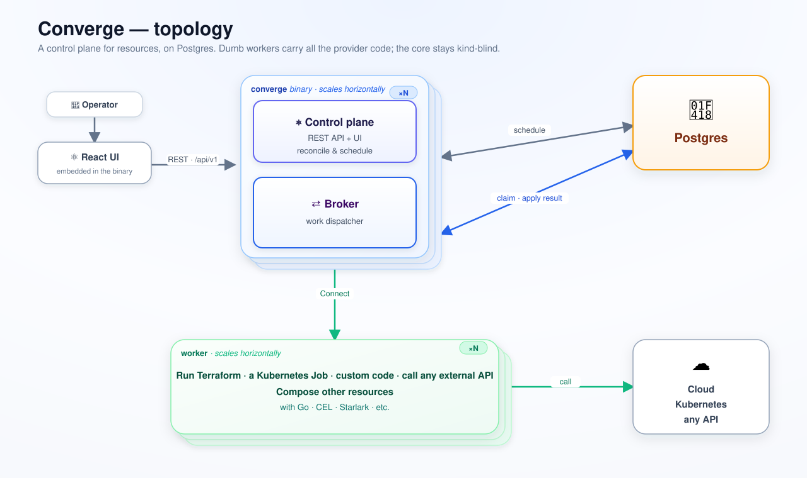

# Concepts

## The one-sentence version

You **declare** the resources you want as specs; Converge **reconciles** the real
world to match them — creating a resource's children in dependency order, flowing
each one's outputs into the next, healing drift, and rolling everything up into one
trustworthy status.

That's the loop Kubernetes made familiar, generalized to *any* resource (not just
containers) and run on *Postgres only* (no etcd, no controllers you write by hand).

## The nine nouns

**1. Resource.** The unit. A row that says "I want a thing of this *kind*, named
this, shaped like this spec." It has a `generation` (bumped on every spec edit) and
a `synced_gen` (the generation the world was last reconciled to). When they match and
health is OK, the resource is **Ready**. Everything — a top-level request and every
child it fans out into — is a resource.

**2. Kind.** The *type* of a resource — `vpc`, `account`, `landingzone`. A kind is
taught to the core by applying a **manifest** (a Kubernetes-CRD-style document, with
a JSON-Schema spec) to the database, plus handler code in a worker. The core itself
knows *no* concrete kind — it is [kind-blind](architecture.md); that's what makes it
provider-agnostic and open-sourceable.

**3. Spec.** The desired state, as JSON, validated against the kind's schema at the
gateway. `{ kind: vpc, name: prod, spec: { cidr: "10.0.0.0/16" } }`. You edit the
spec; Converge does the rest. You never write the *steps* — only the *want*.

**4. Provider + Worker.** A **provider** is the handler code for one kind: given a
task, do the work (call an API, run Terraform, run any binary) and report an
**outcome**. A **worker** is a separate, database-free process that hosts one or more
providers, dials a broker, and pulls tasks. A worker can be written in
[any language](why-code-not-yaml.md) — Converge ships a [Go](../sdk-go/converge) and a
[TypeScript](../sdk-ts) SDK, and a built-in [`stdio`](../examples/demos/stdio) provider
that turns *any external program* into a kind with no SDK at all. See
[implementing a provider](implementing-a-provider.md).

**5. Composer.** A provider whose job is to expand one resource into a whole graph of
**child** resources. `landingzone` → 100 `account`s → each account's `vpc`s, `route`s,
`tgw`. The composer is *just code* (Go, [CEL](https://github.com/google/cel-go),
[Starlark](https://github.com/google/starlark-go), or an external program), so the
composition logic is data you edit live — not a templating dialect.

**6. Dependency & value flow.** Children don't just exist — they *depend*. A
dependency edge says "the route needs the VPC first," so Converge brings them up in
order. A **value flow** says "the VPC's `vpc_id` output flows into the route's spec" —
first-class declarative data, gated until the upstream is Ready and re-substituted on
every upstream change. No glue code wires them.

**7. Status (two axes → one phase).** Every resource has two independent axes:
**Synced** (did we reconcile the current spec?) and **Ready** (is it actually
healthy?). They collapse into one **phase** you read at a glance — `Ready`,
`Reconciling`, `Degraded`, `Failed`, `Orphaned`, `Quarantined`, `Deleting`. A
composite's readiness **rolls up** from its children: it's green only when every
child is, and it *names the one that degraded*.

**8. Reactor.** A durable side effect on a lifecycle transition — "after this
resource is `synced` (or `failed`, or `deleted`), do Y." You wire one with an editable
`reactor_bindings` row, no code. It's an emergent saga with no saga type to write:
delivered at-least-once, deduplicated by a fence.

**9. Provider config (default + override).** How you tune a provider without
redeploying it. It has two tiers that *merge per task*:

- The **kind default** — one config for the whole kind (a spec object plus an opaque
  bundle of bytes, e.g. a CEL/Starlark program or credentials), edited live via the
  API. The engine pushes it to every worker hosting that kind; the provider receives
  it in `OnConfig`.
- The **per-resource override** — optional, carried on the individual resource; it
  rides the task to the worker.

The **effective** config a handler actually uses is `default ⊕ override`, and the
merge happens *in the handler*: the spec deep-merges (the override wins per key) via
`EffectiveConfig`, and the opaque bundle whole-replaces via `EffectiveBundle` (opaque
bytes can't deep-merge). Both tiers are runtime-editable — no restart, no redeploy.

## The one verb: reconcile

Given all of the above, the engine runs one loop, continuously, over millions of
resources:

```
   spec edited  ──▶  generation bumps  ──▶  resource becomes eligible
        ▲                                              │
        │                                              ▼
   drift detected                              task pushed to worker
        ▲                                              │
        │                                              ▼
   result written back  ◀──  outcome reported  ◀──  provider does the work
```

Three properties make it trustworthy at scale:

- **Reactive, not polled.** Work is *pushed* to workers the instant a resource
  becomes eligible — a change propagates immediately, and the push path coalesces so
  a burst doesn't storm the fleet.
- **At-least-once, idempotent.** Work may be redelivered; a monotonic **claim-epoch**
  fence makes a stale, zombie, or misrouted result a harmless no-op. Nothing is applied
  twice.
- **Self-healing.** A resource that drifts from its spec flips out of Ready and
  re-reconciles on its own — no spec edit needed. A worker that goes silent has its
  work reclaimed and re-dispatched.

## How the pieces run

One `converge` binary plays two roles — **control** (the sweepers + REST API) and
**broker** (the mesh workers pull work from) — over one **Postgres** database that is
the entire substrate (no message broker, no queue service). **Workers** are separate
processes that dial the broker. Pods discover each other and shard the keyspace with
no leader election.



## Where to go next

- **See it converge** — the [Quickstart](../README.md#quickstart): one command stands
  up the whole thing and runs a live demo.
- **Write a kind** — [implementing a provider](implementing-a-provider.md).
- **Why real code, not YAML** — [the design rationale](why-code-not-yaml.md).
- **The full feature surface** — [Converge at a glance](features.md).
- **The deep internals** — [architecture](architecture.md).
