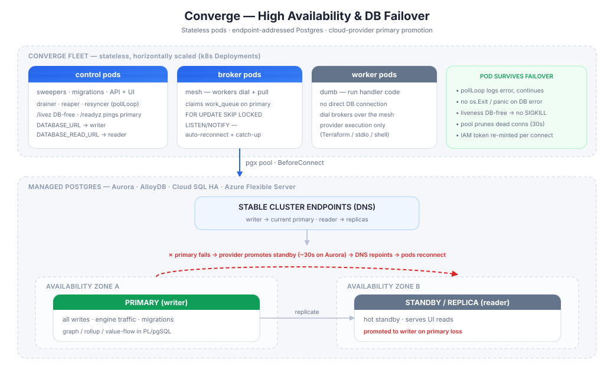

# High Availability & Disaster Recovery

How Converge stays available across pod failures, database failovers, and zone
loss — and what you, the operator, own versus what the platform provides.

## TL;DR

- **Converge pods are stateless.** All durable state lives in Postgres; any pod
  can die and be rescheduled with no data loss. Availability of the *control
  plane* is a matter of running ≥2 pods per role behind a k8s Deployment.
- **Converge does not perform database failover — and shouldn't.** Promoting a
  new primary is the *database's* job. Converge is a well-behaved client: it
  connects to a **stable endpoint**, survives the connection drop a failover
  causes, reconnects automatically, and re-drives any interrupted work
  idempotently.
- **Run on AWS Aurora PostgreSQL.** Converge has been run against Aurora and
  behaved the same as the local Postgres testcontainer used in the integration
  suite. The reconnect / retry behaviour described below follows from the
  architecture (stateless pods, endpoint-addressed connections, idempotent
  at-least-once work), so *in theory* a primary failover should be absorbed
  transparently — treat that as designed-for. By the same reasoning, any real,
  fully-Postgres-compatible managed database on a cloud provider — GCP AlloyDB /
  Cloud SQL (HA), Azure Database for PostgreSQL (zone-redundant HA), and others —
  should work equivalently, since Converge depends only on standard Postgres. See
  [Supported managed databases](#supported-managed-databases).

## The two layers of "failover"

"Auto failover for the primary" means two different things. Converge owns one of
them:

| Layer | Responsibility | Owner |
| --- | --- | --- |
| **Promote a new primary** when the old one dies | Detect failure, promote a standby, repoint the endpoint DNS | **The database** (Aurora / AlloyDB / Cloud SQL / Azure — or your own Patroni/pg_auto_failover) |
| **Recover the application** across that event | Reconnect, retry interrupted work, don't corrupt state, don't restart-storm | **Converge** |

The rest of this document is about the second row — what makes Converge safe to
run on top of an auto-failover database.

## Why the pods survive a failover

A primary failover drops every open connection and aborts every in-flight
transaction for a short window (~30 s on Aurora, longer on classic Multi-AZ).
Converge is built to treat that as an ordinary transient event, not an outage:

1. **Endpoint-addressed, not node-addressed.** Pods connect to whatever hostname
   is in `DATABASE_URL` — the cluster **writer endpoint**, whose DNS the provider
   repoints to the freshly-promoted primary. There is no hard-coded node address
   to go stale. Reads use `DATABASE_READ_URL` (the **reader endpoint**); see
   [Read/write split](#readwrite-split).

2. **The connection pool self-heals.** Pools are built in
   [`applyPoolHealthDefaults`](../cmd/converge/main.go) with
   `HealthCheckPeriod = 30s`, `MaxConnLifetime = 30m` (+5 m jitter), and
   `MaxConnIdleTime = 5m`. Broken connections left over from the old primary are
   detected and discarded; new connections re-resolve the endpoint DNS and, under
   IAM auth, re-mint a fresh token on **every** physical connect via the
   `BeforeConnect` hook ([`internal/awsauth/iam.go`](../internal/awsauth/iam.go)).

3. **`LISTEN`/`NOTIFY` reconnects automatically.** The reactivity layer
   ([`internal/runtime/listen.go`](../internal/runtime/listen.go)) holds one
   dedicated connection per channel; on **any** connection error it logs, backs
   off, and re-subscribes. Crucially, its `onReady` callback fires a **catch-up
   read** after every (re)subscribe — so a `NOTIFY` missed during the failover
   window is recovered on reconnect, not lost. Even absent that, `NOTIFY` is only
   a latency optimisation over each component's failsafe poll.

4. **Engine loops log-and-continue; they never crash the pod on a DB error.**
   Every sweeper (drainer, reaper, resyncer, spec-GC) runs under
   [`pollLoop`](../internal/runtime/poll.go), which logs a tick error and keeps
   looping — the pod does not exit. There are **no `log.Fatal` / `os.Exit` /
   `panic` calls in the runtime, broker, or store hot paths** on a query error.

5. **Health probes are failover-aware — no restart storm.**
   ([`internal/health/health.go`](../internal/health/health.go))
   - `/livez` and `/healthz` are **deliberately DB-free**: a DB blip must never
     make the kubelet SIGKILL an otherwise-healthy pod (which would turn a
     transient outage into a restart storm and pull connections out from under
     in-flight work).
   - `/readyz` pings the primary with a short (2 s) timeout: a pod that briefly
     can't reach Postgres reports **NotReady** and is pulled from Service
     endpoints until the DB recovers — then re-added, **without a restart**.

## Why no work is lost or double-applied

A failover *will* abort transactions mid-flight. Converge's correctness model —
the same one that makes it safe under at-least-once delivery generally — absorbs
this:

- **Queue claims are idempotent and lock-scoped.** Work is claimed with
  `SELECT … FOR UPDATE SKIP LOCKED`; a claim whose transaction dies during
  failover is simply never committed — the row stays claimable and is re-claimed.
- **State transitions are generation-aware.** Applying the same work twice is a
  no-op against the resource's generation, so redelivery after a failover cannot
  double-apply.
- **The reaper is the durable backstop.** `RequeueFailedAndPending` /
  `ReapStaleWork` ([`internal/runtime/reaper.go`](../internal/runtime/reaper.go))
  periodically re-drive any row left stale or lagging — including work whose
  in-flight transaction was killed by a failover. So even an operation that
  errors out during the failover window is picked back up on a subsequent tick.

**Net effect (by design):** during a failover blip some operations should error
once and retry via the poll/reaper cycle; after the endpoint repoints, the fleet
should converge to the correct state with no lost or duplicated resource actions.
This follows from the idempotency model rather than from a measured failover run.
Normal (non-failover) operation on Aurora has matched the local testcontainer.

## Read/write split

Converge takes two DSNs so it maps cleanly onto every managed cluster's
writer/reader endpoints:

| Env var | Points at | Traffic |
| --- | --- | --- |
| `DATABASE_URL` | Cluster **writer** endpoint (primary) | All writes, all engine traffic (drainer, reaper, resyncer, broker claims), migrations |
| `DATABASE_READ_URL` *(optional)* | Cluster **reader** endpoint (replicas) | UI/API `GET`s only. Empty → reads fall back to the primary. |

The read pool additionally caps any single query with a server-side
`statement_timeout = 30s` (it serves only short read-only UI queries), while the
primary pool is left unbounded for the seconds-long drain/reconcile transactions.
See the pool construction in [`cmd/converge/main.go`](../cmd/converge/main.go).

> Reader endpoints are eventually consistent (replica lag). This is fine for the
> UI, which already polls on a 1.5–5 s interval; never route a read that a write
> path depends on to the reader endpoint.

## Supported managed databases

**Tested so far: AWS Aurora PostgreSQL only** (normal operation, matching the
local testcontainer). Everything else in this table is expected to work but **has
not been verified** — Converge uses only standard PostgreSQL (pgx + PL/pgSQL,
`FOR UPDATE SKIP LOCKED`, `LISTEN`/`NOTIFY`), so *in theory* any
fully-Postgres-compatible managed service with automatic failover and a stable
endpoint should be a DSN-only change, but confirm before relying on it.

| Service | Cloud | Auto-promotes primary | Endpoint model | Tested | Notes |
| --- | --- | --- | --- | --- | --- |
| **Aurora PostgreSQL** | AWS | ✅ (~30 s) | writer + reader endpoints | Run against (normal operation) | Pair with IAM auth (`DB_IAM_AUTH=true`); consider RDS Proxy at high pod counts. |
| **RDS PostgreSQL (Multi-AZ)** | AWS | ✅ (~60–120 s) | instance endpoint repointed | Not verified | Classic HA; expected same client behaviour. |
| **AlloyDB** | GCP | ✅ | writer + read endpoints | Not verified | Closest architectural analog to Aurora. |
| **Cloud SQL (HA)** | GCP | ✅ | connection name repointed | Not verified | Regional HA standby. |
| **Azure PostgreSQL Flexible Server** | Azure | ✅ | stable endpoint | Not verified | Enable zone-redundant HA. |
| **Neon / Aiven / Crunchy Bridge / EDB** | multi-cloud | ✅ | writer/reader endpoints | Not verified | Managed Postgres with failover; portable, avoids lock-in. |

**Distributed SQL** (CockroachDB, YugabyteDB) offers stronger availability (no
single primary to promote) but is **not a drop-in**: Converge leans on native
PL/pgSQL, specific locking/index behaviour, and `LISTEN`/`NOTIFY` that these
engines don't fully match. Treat a move to them as a migration with re-validation
of the hot paths, not a DSN swap.

### IAM authentication (AWS)

With `DB_IAM_AUTH=true`, Converge mints short-lived IAM tokens per physical
connection (`BeforeConnect`), covering the primary pool, the read-replica pool,
and the `migrate` path (`openMigrateDB` authenticates to Aurora exactly like the
running pods). The 30-minute connection recycle doubles as the token-refresh
cadence. No static database password is used.

## Recommended production posture

**Control plane (Converge):**
- Run **≥2 pods per role** (control, broker) behind k8s Deployments across zones;
  a PodDisruptionBudget keeps a quorum during node drains/upgrades.
- Keep liveness DB-free (default) so DB blips don't restart pods; rely on
  `/readyz` to shed traffic from a pod that briefly can't reach the DB.
- On SIGTERM, pods mark themselves NotReady before draining
  (`health.SetDraining`) so k8s stops routing new work while in-flight work
  finishes.

**Database (platform):**
- Use a **multi-AZ** managed cluster with automatic failover (table above) and
  connect via its **writer/reader endpoints**, never a node address.
- Point `DATABASE_URL` at the writer endpoint and `DATABASE_READ_URL` at the
  reader endpoint.
- **AWS, high pod counts:** consider **RDS Proxy** in front of Aurora — it pools
  connections and holds clients through the failover window, smoothing the
  connection storm a large fleet would otherwise create on promotion.

## Disaster recovery (region loss)

Zone loss is handled transparently by a multi-AZ cluster (above). For **region**
loss:

- **Database:** use the provider's cross-region DR — e.g. **Aurora Global
  Database** (a secondary-region replica promotable in minutes; the repo's
  operator tooling includes an Aurora-global setup script). AlloyDB, Cloud SQL,
  and Azure have equivalent cross-region replicas. RPO/RTO are the database's
  characteristics, not Converge's.
- **Control plane:** because pods are stateless, DR is simply "run the Converge
  Deployments in the DR region and point `DATABASE_URL` at the promoted regional
  endpoint." No Converge-side state to restore.
- **Backups:** rely on the managed service's automated backups / PITR. Converge
  adds no state outside Postgres, so a database restore is a full restore of the
  system.
